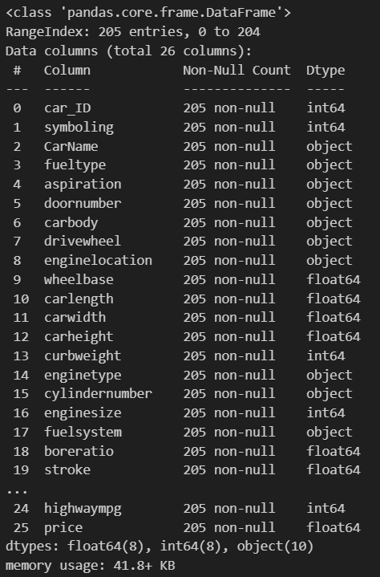
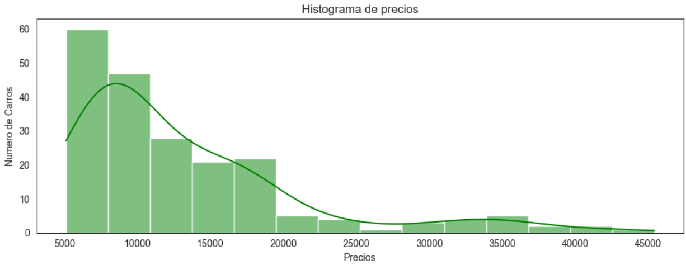
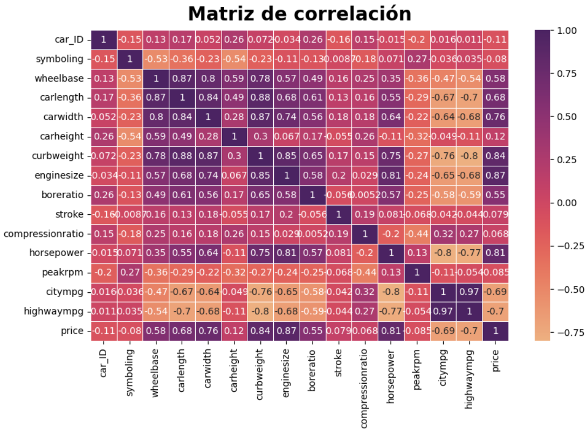

# 

# Modelo de prediccion de precio de vehiculos 

​​Machine Learning en investigación de mercado automotor: El mercado automotor esta muy ligado a la cultura de cada país, según los gustos de cada uno, el mercado norteamericano, por ejemplo, valora mucho los motores y vehículos muy grandes, el mercado europeo prefiere el bajo consumo, el mercado latinoamericano, los precios finales bajos y asi varía según región, país, nivel socioeconómico y cultura. Un mismo vehículo puede tener un valor muy distinto de un pais al otro, y no solo por los impuestos o costos de producción, sino por cómo cotiza el modelo en el mercado.

## Planteamiento del problema

​Hemos sido contratados en el equipo de ciencias de datos en una consultora de renombre. Nos han asignado a un proyecto de estudio de mercado de una importante automotriz china. Nuestro cliente desea ingresar a nuestro mercado de automóviles, por lo que nos han encomendado analizar las características de los vehículos presentes en el mercado actual. Dado que tienen en su catálogo una amplia colección de modelos de todo tipo, cuyo catálogo está estratificado en gamas según el gusto de cada región, desean saber qué características presentan los vehículos de gama alta y los de gama baja en nuestro mercado, para poder abarcar todo los públicos objetivos ajustándose a toda la demanda y, en base a estos datos, poder cotizar correctamente los vehículos que ofrecerá.

# Desarrollo 

Como primer paso realizamos una analisis del data set, buscando que este equilibrado, que no tenga valores faltantes o que no tenga algun valor atipico, y notamos que todos los datos estan bien.

# 

Graficando este histograma notamos que la mayoria de autos son de bajo precio en comparacion con los mas costosos.

# 

Despues realizamos una matriz de correlacion para analizar que aspectos influyen mas con respecto al precio del automovil.

# 